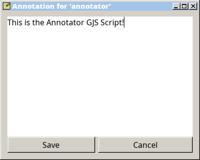

# Annotator GJS utility

A small utility to describe files and folders in GTK.

The main dependency is GJS -- the Gnome interpreter for JavaScript.

## Installation:

* Save the file `annotater` wherever you want, make sure that it is executable.
* In order for it to work with the Thunar file manager, it must be written to Thunar's "Special Actions" using the command line `annotator %f`.
* In order for this to become a plugin for **Nemo**, the files `annotator` and `annotator.nemo_action` must be placed in `~/.local/share/nemo/actions`.

## Usage:

* Run: `annotator "/path/to/file"`
* Edit it's annotation.
* Press 'Save' or 'Cancel' button.
* You may press 'Escape' button on your keyboard to exit.

## How it works:

It uses Gio library to edit the `metadata::annotation` attribute of the file. If yor system uses another attribute, you can change it in the script file.

## Localization:

* Do it for yourself.
* Edit the `annotation` script file.
* Translate the underlined substrings: "title: <u>Annotation for</u>". "label: '<u>Save</u>'", "label: '<u>Cancel</u>'" to your language.
* For custom window title icon change the `icon_name` value.

## Screenshot:

